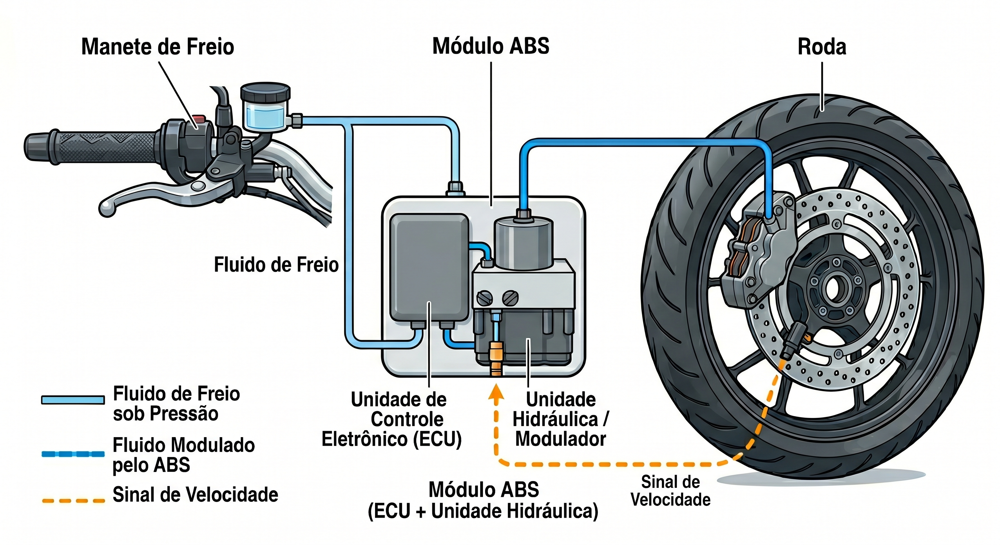
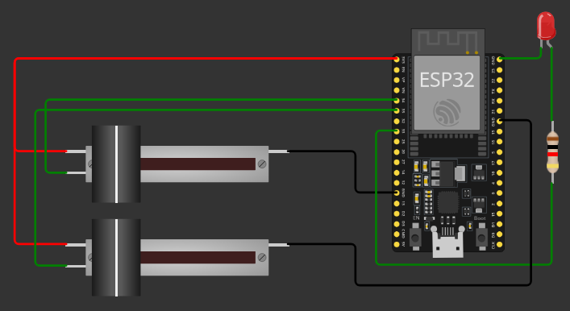

# Processo Seletivo – Intensivo Maker | IoT
## Etapa Prática – Sistemas Embarcados

**Relatório do Projeto – Sistema de freio ABS**

Identificação do Candidato: Rafael da Silva Sousa

## 1️⃣ Visão Geral da Solução

Este projeto objetiva implementar um sistema de segurança de freio do tipo ABS (Antilock Braking System) utilizando um microcontrolador ESP32 como módulo ABS, potenciômetros deslizantes para simular acelerador e freio e um LED que alerta ao condutor sobre a ativação do sistema.

Tal solução se demonstra útil como suporte didático a cursos de mecânica que necessitam de uma abordagem simples ao ensino prático de funcionamento do sistema de freio ABS, que é, hoje, o sistema de segurança de freios mais utilizado no mundo.

<i>Imagem 1: Esquema visual do funcionamento de um sistema de segurança ABS.</i>

O sistema de segurança de freios ABS baseia-se na ação de uma ECU (Electronic Control Unit) que monitora constantemente a velocidade do veículo e a pressão dirigida ao manete de freio e envia sinais para as pinças controladoras dos freios na(s) roda(s). Caso a velocidade atual do veículo esteja acima de uma certa velocidade mínima (geralmente 20 km/h) e se distribua sobre o manete de freio uma pressão alta em um tempo muito curto, a ECU envia sinais para as pinças de freio na roda de modo a evitar o travamento desta, intercalando as frenagens.

No projeto, o microcontrolador ESP32 simula a ação da ECU de um sistema ABS real, recebendo os sinais dos potenciômetros conectados à porta 34 (punho do acelerador) e à porta 35 (manete de freio) e enviando sinais para o LED de forma a indicar visualmente três estados: ausência de frenagem (LED apagado), frenagem segura em qualquer velocidade (LED com luz contínua) ou atuação do modo PÂNICO (LED piscando). Além disso, alertas de texto são printados no terminal de forma a mostrar o valor de variáveis como velocidade atual e o status do sistema ABS.

## 2️⃣ Arquitetura do Sistema Embarcado

<i>Imagem 2: Circuito do projeto. O potenciômetro deslizante de cima representa o punho do acelerador, enquanto o de baixo representa o manete de freio.</i>

 **Bibliotecas Utilizadas**

- machine → controle de pinos
- time → controle de funções de temporização, como time.ticks_diff()

**Fluxo principal do programa (main.py)**

O programa opera em um laço infinito (while True) a cada 50ms, estruturado da seguinte forma:

* **Sensoriamento e lógica**: Lê as entradas analógicas (acelerador e freio), calcula a variação brusca da pressão e aciona a máquina de estados (Livre, Frenagem Normal ou Pânico/ABS).
* **Dinâmica Veicular**: Atualiza continuamente a velocidade virtual da moto, aplicando as regras matemáticas de aceleração, inércia e desaceleração.
* **Atuação não-bloqueante**: Controla o LED (fixo no freio normal, pulsante no ABS) utilizando o relógio interno (time.ticks_ms()) para evitar travamentos (sleep), além de enviar a telemetria via serial.

**Estrutura de funcionamento**

O programa se divide em duas funcionalidades básicas:

* **Simulação da dinâmica veicular**:
A velocidade atual do veículo é calculada em tempo real a partir da leitura dos potenciômetros que representam o acelerador e o freio. Caso o freio esteja "solto", a velocidade atual é incrementada em 1.5% do valor lido do potenciômetro do acelerador (cuja leitura é retornada pela função ler_acelerador() e vai de 0 a 100).
Caso não haja nenhuma pressão no acelerador ou no freio, a velocidade atual é decrementada em 0.3, para simular o atrito com o ambiente que faz com que o veículo perca velocidade aos poucos.
Se houver alguma pressão no freio, a perda de velocidade é calculada de forma proporcional a ela, que pode ser de 2% da força aplicada ao freio ou um valor fixo de 2.5, quando o modo PÂNICO é ativado, de modo a prover uma frenagem com segurança.
Em todos esses casos, o programa emite status iterativos no terminal, alertando sobre o estado atual de aceleração/frenagem.
* **Lógica da ECU e Status de terminal**:
A máquina de estados avalia as variações de pressão e velocidade, refletindo o comportamento no terminal e no LED:

    * **LIVRE/SOLTO**: O freio não está sendo utilizado. A inércia ou o acelerador controlam a dinâmica. *LED apagado*.

    * **FRENAGEM NORMAL**: Acionamento progressivo e suave do freio, ou frenagens em baixa velocidade (< 20 km/h). A desaceleração obedece diretamente à pressão no manete de freio. *LED com luz contínua*.

    * **PÂNICO (ABS)**: O sistema detecta uma variação brusca de pressão no freio em um intervalo de tempo curto, indicando risco de travamento em alta velocidade. A ECU assume a modulação do freio e a válvula atua de forma não-bloqueante. *LED pisca*.

**Temporização**

O programa opera em um laço contínuo (while True) que atualiza as informações a cada 50ms. Desse modo, o tempo de resposta entre um comando de aceleração ou frenagem e a ação tomada pela ECU ocorre em um tempo curto o bastante para simular o funcionamento de um sistema de segurança ABS da vida real.

**Interação entre componentes**

Mudança no sinal do potênciometro do acelerador ou do freio → Processamento do estado atual pela ECU → Mudança no sinal luminoso do LED (se necessário)

## 3️⃣ Componentes Utilizados na Simulação
| Componente                 | Função                                                                                                         |
|----------------------------|----------------------------------------------------------------------------------------------------------------|
| **ESP32** | Microcontrolador principal responsável por processar a dinâmica veicular e a lógica da ECU do ABS.             |
| **Potenciômetro Deslizante 1** | Simula o punho do acelerador, variando o sinal analógico para aumentar a velocidade virtual da moto.           |
| **Potenciômetro Deslizante 2** | Simula o manete de freio, medindo a pressão aplicada pelo piloto para calcular a desaceleração ou disparar o ABS. |
| **LED Vermelho** | Atua como a válvula solenoide do ABS. Indicando frenagem normal ou controlada pelo sistema ABS |
| **Resistor** | Garante a proteção elétrica do LED, limitando a corrente no circuito  |

## 4️⃣ Decisões Técnicas Relevantes
* **Temporização não-bloqueante**:
No projeto se optou pelo uso de time.ticks_ms() no lugar de sleep() para pulsar o LED do ABS, com o intuito de garantir que não houvesse uma parada no fluxo do programa enquanto o LED estivesse piscando, ao entrar no modo PÂNICO.
* **Mapeamento da velocidade atual**:
Em vez de se mapear a velocidade atual diretamente pelo sinal do potenciômetro do acelerador, se escolheu uma abordagem independente, onde o cálculo da velocidade depende não apenas do acelerador como variável, mas também do estado do freio. Isso permitiu simular de forma realística as mudanças na velocidade de veículos reais, que é impactada por fatores como freio, e atrito com o ambiente, além do sinal do acelerador.
* **Detecção de modo PÂNICO**:
O acionamento do ABS não avalia apenas a força total no manete, mas sim a taxa de variação da pressão (comparando o ciclo atual com o anterior). Isso emula o comportamento real de uma ECU, que detecta o travamento da roda através de mudanças bruscas na força aplicada ao manete.
* **Escolha dos potenciômetros**:
A escolha por potenciômetros deslizantes em portas analógicas foi feita para simular o curso real e progressivo de um manete de freio e de um punho de aceleração (0% a 100% de pressão).

## 5️⃣ Resultados Obtidos

Ao deslizar o potenciômetro do acelerador e permitir que a velocidade atual ultrapasse a barreira dos 20 km/h, é possível perceber que, ao deslizar o potenciômetro do freio de forma brusca, o LED começa a piscar rapidamente; esse é o comportamento esperado, uma vez que frenagens bruscas em momentos onde a velocidade atual é superior a 20 km/h devem ativar o modo PÂNICO, que deve, de fato, enviar o sinal para que o LED pisque.
No caso de frenagens graduais, vemos que o LED permanece aceso continuamente de forma correta, já que o modo PÂNICO é ativo apenas com frenagens bruscas em velocidades acima de 20 km/h e frenagens comuns devem, de fato, deixar o LED aceso de forma contínua.
Em velocidades abaixo de 20 km/h, temos que qualquer pressão dada no potenciômetro de freio faz com que o LED fique aceso de forma contínua. Esse é o comportamento esperado, já que, nessa velocidade, mesmo frenagens bruscas não devem ativar o modo PÂNICO.

## 6️⃣ Comentários Adicionais

* No final do laço de repetição principal, são incluídas algumas "travas de segurança", que atribuem 0 à velocidade atual caso ela tenha sido decrementada para um valor menor que zero (impossibilitando velocidades negativas) e 140 caso a velocidade tenha sido incrementada a um valor maior que 140.
* Optou-se por colocar o print("Teste") (necessário para o fim da execução do workflow do actions) após a primeira iteração do laço while, de modo a garantir ao workflow que não ocorrem erros até esse ponto do código.

**Dificuldades encontradas**
- Fazer com que o LED piscasse no modo PÂNICO sem paralisar o programa.
- Tornar o mecanismo de simulação da velocidade atual tão realista quanto possível.
- Implementar o mecanismo de detecção de modo PÂNICO com base na pressão exercida no potenciômetro de freio.
- Fazer com que a execução do programa não fosse muito custosa em termos de processamento e gasto de tempo, por conta do actions.

**Limitações**
- Ausência de sensores capazes de simular de forma mais realista os sinais de acelerador e freio.
- impossibilidade de simular o fluido de freio, seus diferentes tipos e sua interação com as pinças de freio.

**Melhorias futuras**
- Implementação de um mecanismo mais realista de simulação da desaceleração causada por fatores como vento e freio motor.
- Utilização de diversos sistemas de segurança ABS combinados entre si, de modo a simular sistemas do tipo duplo, triplo ou quádruplo canal.

**Aprendizados**:
- Utilização da plataforma de simulação Wokwi; integração via GitHub Actions e gerenciamento de chaves (Tokens).